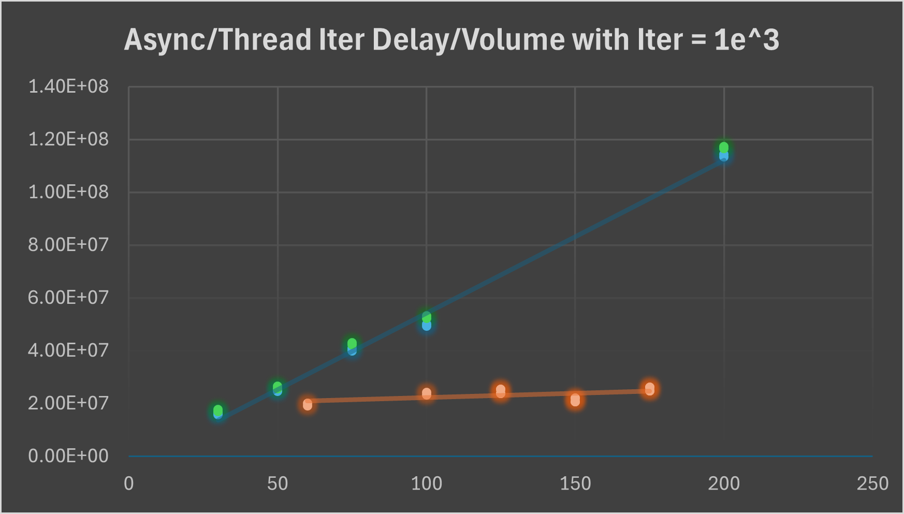
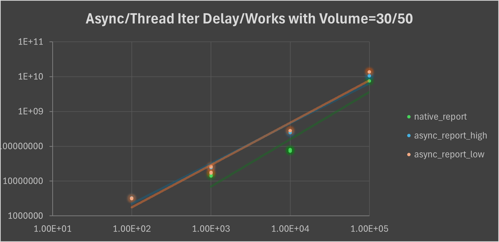
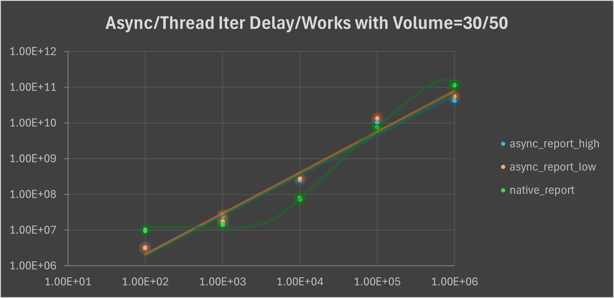
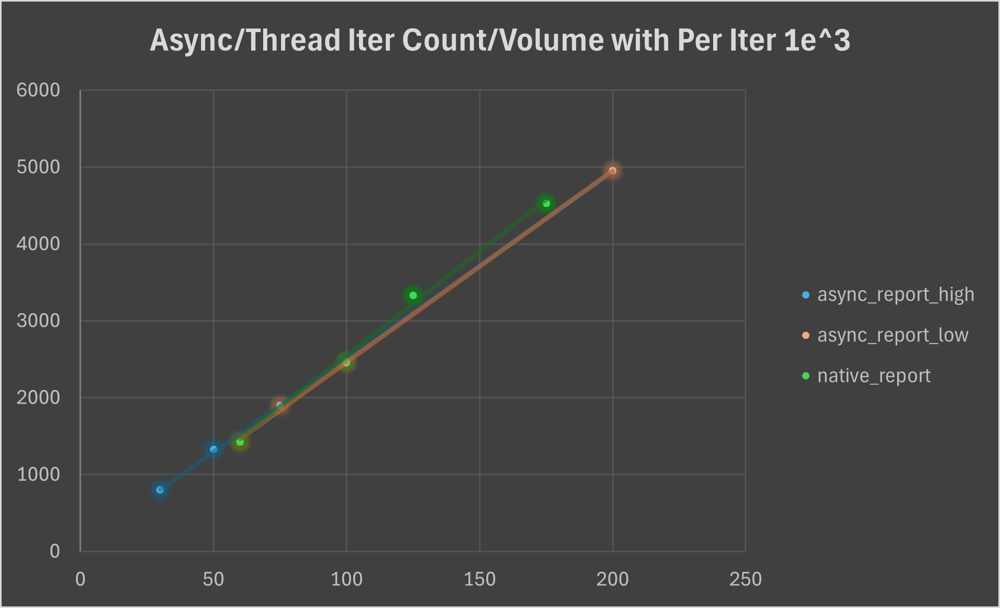
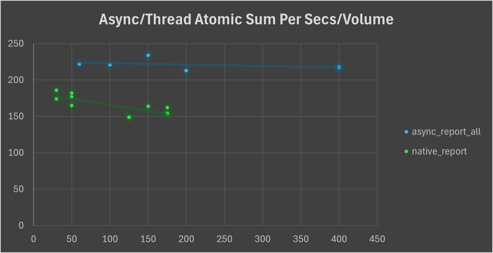

# AxEmbassy-Measure

We consider embassy task instance, which is async as same work unit as native thread.

Thus we let them do same work, measure the deviation from the expected sleep time as the standard.

```rust
(async) fn busy_work(iters: u64) -> u64 {
    let mut total = 0;
    for _ in 0..iters {
        total = black_box(total + 1);
		(yield_now.await/yield_now())
    }
    black_box(total)
}
```

Above code is the busy work each thread/task need to do. With `yield_now` as a `await` point to fully exploit the mechanism of async.

We code a macro to adapt this, with a `sleep_fn` to sleep, and measure the time elapsed denoted as `actual`(The time elapsed in each iteration) and `full`(The time elapsed between the last and current iteration)

```rust
macro_rules! work_loop {
	...
        loop {
            let iter_start = Instant::now();
            cnt += 1;

            $($busy_tt)*
            $($sleep_tt)*
            $($($output_tt)*)?

            let iter_end = Instant::now();
            let iter_dur = iter_end - iter_start;
            let full_dur = iter_end - last_report;

            log::info!(
                "{} {}: volume {}, works {}, times {}/s, iters {}, expected {}/ns, actual {}/ns, full {}/ns",
                $task_type,
                $id,
                $volume,
                NUM_ITERS,
                TEST_SECS,
                cnt,
                expected.as_nanos(),
                iter_dur.as_nanos(),
                full_dur.as_nanos(),
            );

            last_report = iter_end;
        }
}
```

## Iteration Delay

- The experiment is created to execute within `volume` threads **or** `volume` tasks(divide into half with high priority and low priority). Numbered from 1 to `volume` as `id`, with a modulo sleep time by iterations `i % 20 + 1` seconds. Recording `actual` and `full` elapsed time as the execution time of the work unit.

- Each work unit will implement `busy_work` with a same iterations as metric. After a fixed 150 seconds in `main` thread, we finish our record.

- Experiments varying `volume`, `works`(iterations of `busy_works`), acquire `delay`(mean delay of each `work_loop` iteration) and `count`(iteration counts of `work_loop`).

We fix `busy_work` iterations as `1e^3` to acquire `delay` as below:



Here the blue(high) and green(low) is **async task**, while orange is **thread task**. We see a increasing trend of async task much higher than thread, comes from the burden of poll in linear data structure of embassy executor for the sole thread, while thread is preemptive to interrupt in time slice, introduce a nearly constant time here.



Here the blue and orange is **async task**, while orange is **thread task**. With logarithm horizontal and vertical axis, we see both a linear and roughly close linear growth.

We try to test higher iterations on it and shows below:



That's we extend the test time to 300 seconds to acquire a full data on rather lengthy iterations. We can see a rather higher increase on thread task, rather, async task maintains linear growth.



We see a linear growth both for thread task and async task with fixed `busy_works` iterations and increase of volume. We see that even the delay of async task is much higher than thread, its iteration counts aren't curbed.

## Atomic Sum

With the assemble experiment construction, we list few adaptation for this.

- We change the sleep time as `(i % 20 + 1)` in millisecond rather second ti mimic latency.
- We add:
  ```rust
    output: {
        iters.fetch_add(1, core::sync::atomic::Ordering::SeqCst);
    },
  ```
  in macro process for atomic read and write.

- We varying `volume` to acquire `sum per secs`. Because iterations increase cause the same effect and huge level will break the original intention of such experiment.



The reason of thread task only reaching `175` in volume is due to the memory restriction. However, we can see a evident decrease of thread task due to collision. However, async task retains a roughly constant throughput per seconds due to the mechanism of async task in single thread.

## Conclusion

During the experiment, we found that compete between thread and embassy executor will starve embassy executor due to its pity time slice compared to other hundreds threads' time slices. That's, if you test **Atomic Sum** test together rather separated, you will find that the throughput of async task only few, like 7-12. So we give up to test it together.

Results of above indicates that priority design isn't a big cost to current executor, especially in volume growth. Also, the higher and stable throughput of async tasks compared to threads.

The wired fact of greater latency effecting nothing on counts of async task, maybe attribute to that tasks indeed works but dragged by the linear time growth of polling.