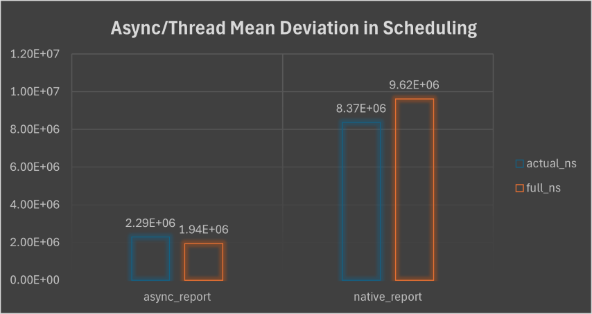
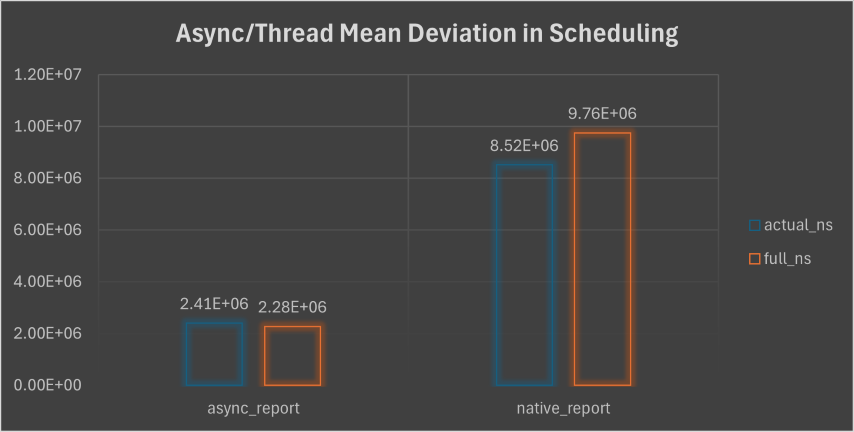
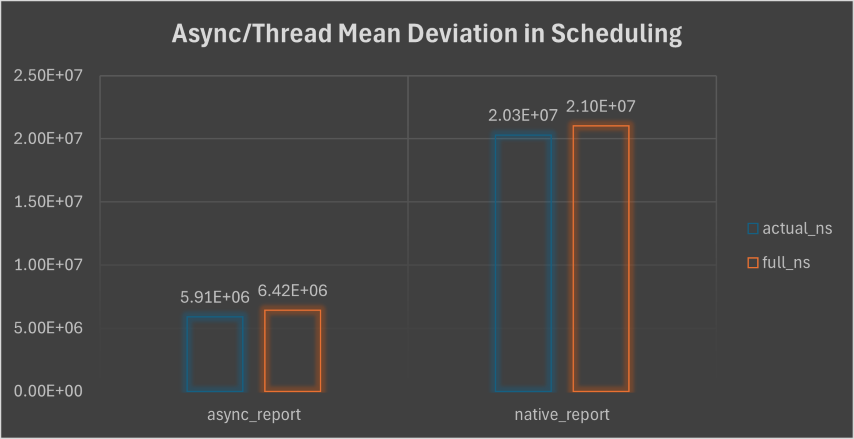
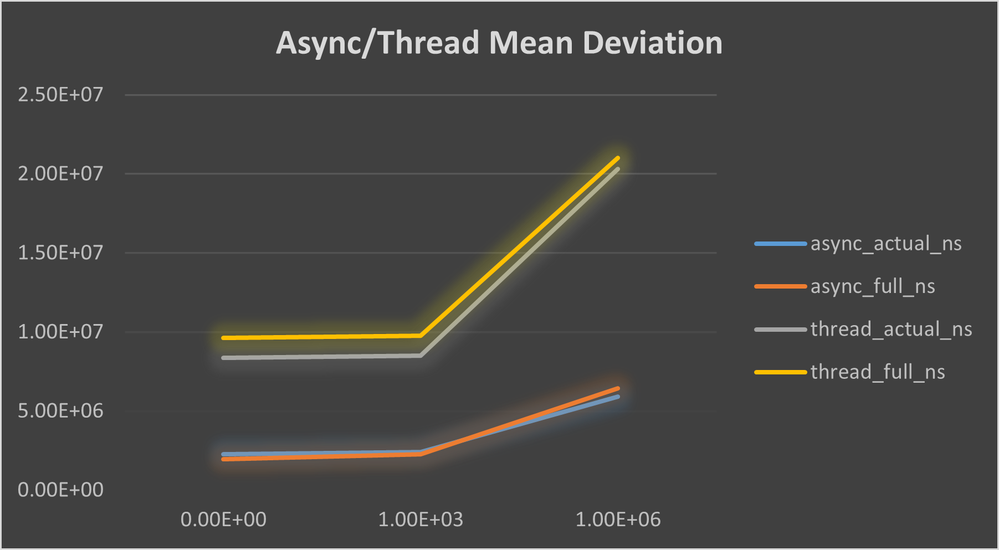
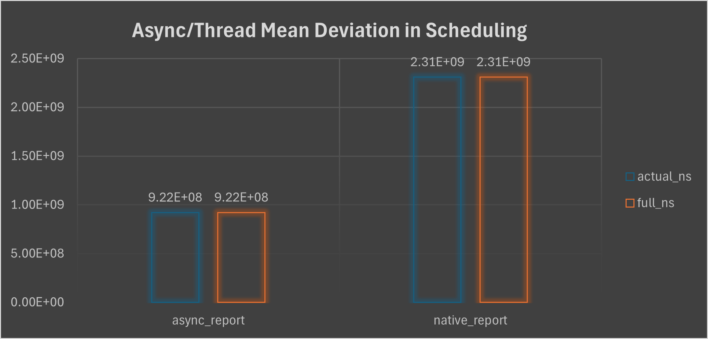

# AxEmbassy-Measure

We consider embassy task instance, which is async as same work unit as native thread.

Thus we let them do same work, measure the deviation from the expected sleep time as the standard.

```rust
(async) fn busy_work(iters: u64) -> u64 {
    let mut total = 0;
    for _ in 0..iters {
        total = black_box(total + 1);
        total = black_box(total * 3 / 2);
		(yield_now.await)
    }
    black_box(total)
}
```

Above code is the busy work each thread/task need to do. With `yield_now` as a `await` point to fully exploit the mechanism of async.

We code a macro to adapt this, with a `sleep_fn` to sleep, and measure the time elapsed denoted as `actual`(The time elapsed in each iteration) and `full`(The time elapsed between the last and current iteration)

```rust
macro_rules! task_loop {
	...
        loop {
            let iter_start = Instant::now();
            cnt += 1;

            if $busy_iters > 0 {
                let busy_start = Instant::now();
                let _res = black_box($busy_work($busy_iters));
                let busy_dur = Instant::now() - busy_start;
                log::info!(
                    "{} {}: duration {}/ns",
                    $task_type,
                    $id,
                    busy_dur.as_nanos()
                )
            }

            $sleep_fn($millis)$(.$await_tt)?;

            let iter_end = Instant::now();
            let iter_dur = iter_end - iter_start;
            let full_dur = iter_end - last_report;

            log::info!(
                "{} {}: Iteration {}, expected {}/ns, actual {}/ns, full {}/ns",
                $task_type,
                $id,
                cnt,
                millis.as_nanos(),
                iter_dur.as_nanos(),
                full_dur.as_nanos(),
            );

            last_report = iter_end;
        }
}
```

- The experiment is created to execute within 5 threads and 5 tasks. Numbered from 1 to 5 as `id`, which also as the argument of sleep seconds. `actual` and `full` elapsed time as the execution time of the work unit.

- Each work unit will implement `busy_work` with a same iterations as metric. After a fixed 15 seconds sleep time in `main` thread, we finish our record.

- Experiments is recorded in `0`, `1_000`, `1_000_000`. Then we dispose each to acquire `Mean Deviaton` which is the deviation from standard sleep time, `standard deviation`, `min`, `max`.

Here the acquired raw data:

- Iteration 0:

```
timestamp	log_type	metric_name	count	mean_absolute_deviation	std_deviation	min_deviation	max_deviation
2025-06-07T11:03:41.814509	async_report	actual_ns	30	2286733.33	1756963.69	199800	8152000
2025-06-07T11:03:41.814509	async_report	full_ns	30	1944600	2028721.36	118200	7841000
2025-06-07T11:03:41.814509	native_report	actual_ns	28	8374135.71	740660.84	6394500	9607200
2025-06-07T11:03:41.814509	native_report	full_ns	28	9622367.86	884432.15	7238900	10619500
```

- Iteration 1_000:

```
timestamp	log_type	metric_name	count	mean_absolute_deviation	std_deviation	min_deviation	max_deviation
2025-06-07T11:05:44.122463	async_report	actual_ns	30	2407603.33	1603948.17	31100	6607700
2025-06-07T11:05:44.122463	async_report	full_ns	30	2278333.33	1617329.34	51700	5893300
2025-06-07T11:05:44.122463	native_report	actual_ns	28	8517207.14	888899.02	6397000	11401100
2025-06-07T11:05:44.122463	native_report	full_ns	28	9757164.29	704841.05	8066400	11429100
```

- Iteration 1_000_000:

```
timestamp	log_type	metric_name	count	mean_absolute_deviation	std_deviation	min_deviation	max_deviation
2025-06-07T11:06:50.810130	native_report	actual_ns	28	20310532.14	6922474.22	9407700	34352800
2025-06-07T11:06:50.810130	native_report	full_ns	28	21025703.57	7147548.24	9848300	34353100
2025-06-07T11:06:50.810130	async_report	actual_ns	28	5905771.43	11346409.74	208500	41821000
2025-06-07T11:06:50.810130	async_report	full_ns	28	6424453.57	11957017.97	5100	41845900
```

Here, we summarize the `Mean Deviation` as the metric, to display charts:

- Iteration 0:

- Iteration 1_000:

- Iteration 1_000_000:


We see that task switch would be quicker than thread, As the difference of `actual_ns` and `full_ns`. And with a better performances roughly 3-3.5 times better on scheduling.

Indeed, we can summarize all to form a line chart.



Indeed this is a great advance compared to thread. Roughly, we test maximal to 100_000_000 iterations, in which we check that:



We see that each maintains its step pace or slope in line graph. After this, any 10 times more would consume times longer than 15 seconds, which is beyond our test boundary.


