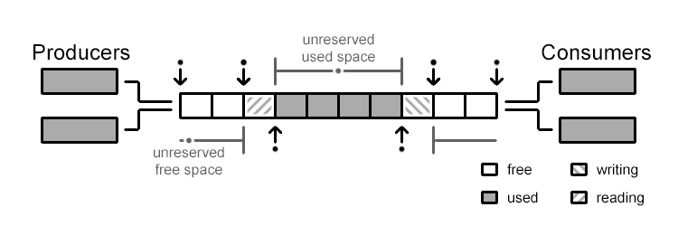

# Record of Learning of Uring

## What is uring?

**[Week 1]**

[uring][uring ref]

- SQ: Submission queue based on circular queue
- CQ: Completion queue based on circular queue
- SQE/CQE: the entry of SQ/CQ

In linux design, SQ only store the serial number of SQEs, CQ store the whole data.

Submission:

- Put SQE in SQEs, record cardinal, update SQ tail.
- Repeat for multiple task.

Completion:

- Kernel complete task, update CQ head.
- User receive task,  update CQ tail.

[uring ref]: https://www.skyzh.dev/blog/2021-06-14-deep-dive-io-uring/

---

## What is a lock free ring buffer?

[ring][ring ref]

**[Week 2]**
[concurrent queue][concurrent queue ref]



Reserve commit to retain space before really modifying. 

---

**[Week 2]**

```rust
struct Slot<T> {
    stamp: AtomicUsize,

    value: UnsafeCell<MaybeUninit<T>>,
}
```
A slot to initiate data and a stamp for atomic operation.

```rust
/// one_lap = mark_bit * 2 = 010...0 where one_lap + idx = real_idx
one_lap: usize,
/// size: 001...0 where size - 1 = 00011... as modulo.
mark_bit: usize,
```
Thus we use `one_lap - 1 = 001111` with `idx & !(one_lap - 1)` to acquire the additional lap of wrapping around.

Suppose a push operation. We first calculate the index and lap which is a wrapping around modulo of index.

```rust
let index = tail & (self.mark_bit - 1);
let lap = tail & !(self.one_lap - 1);

let new_tail = if index + 1 < self.buffer.len() {
    // index + 1 < len means index is in the same lap.
    tail + 1
} else {
    lap.wrapping_add(self.one_lap)
};
```

Then we acquire the data and check whether the stamp is equal to tail index, if so, it means
the local variable tail when the preparation of push and current variable `stamp` is equal, we
try to exchange the tail to new tail and update the slot of tail.

```rust
if tail == stamp {
    // Try moving the tail.
    match self.tail.compare_exchange_weak(
        tail,
        new_tail,
        Ordering::SeqCst,
        Ordering::Relaxed,
    ) {
        Ok(_) => {
            // Write the value into the slot and update the stamp.
            slot.value.with_mut(|slot| unsafe {
                slot.write(MaybeUninit::new(value));
            });
            slot.stamp.store(tail + 1, Ordering::Release);
            return Ok(());
        }
        Err(t) => {
            tail = t;
        }
    }
    ...
}
```

Else, we are in full state that the `stamp` is ahead of `tail`, in order to
reflect the critical condition in error handling on `Slot<T>`,
we should take `full_fence()` then call back the handling.

```rust
else if stamp.wrapping_add(self.one_lap) == tail + 1 {
    crate::full_fence();
    value = fail(value, tail, new_tail, slot)?;
    #[cfg(loom)]
    busy_wait();
    tail = self.tail.load(Ordering::Relaxed);
} else {
    busy_wait();
    tail = self.tail.load(Ordering::Relaxed);
}
```
Where we need the **latest** `slot` here.

[ring ref]: https://kmdreko.github.io/posts/20191003/a-simple-lock-free-ring-buffer/
[concurrent queue ref]: https://docs.rs/crate/concurrent-queue/2.5.0/source/src/bounded.rs

---

## Design IPC

**[Week 1]**

[IPC][IPC ref] (Refactored by AI to reduce redundant design.)

Combine the convenience of uring to establish asynchronous communication.

User:

- call asynchronous kernel function, e.g. `async_read(...)`.
- function will create a `Future` specific for uring called `UringFuture`.
- `spawn()` will push the future wrapped as `Task` into `Executor`.
- When `Executor` first poll the task, it add it to SQ.

Kernel:

- initiate SQ,CQ, `Executor`.
- read and implement `SQE`.
- write `CQE` packed task.

Executor:

- poll task
- submit the SQE of some tasks in batch by `io_uring_submit`.
- read CQE of its `TaskRef` to wake, thus proceed future.

Based on original logic, user calling any kernel asynchronous task will put on the SQE.

Kernel has `Executor` and `Reactor`


[IPC ref]: https://github.com/loichyan/openoscamp-2025s/discussions/8

## Tokio-Uring

**[Week 1]**

[Tokio Uring][Tokio Uring ref]

Tokio uring initialize io-uring SQ,CQ and epoll based runtime. Using asynchronous task `epoll_wait` to notify and draining all completion tasks.

> When the kernel pushes a completion event onto the completion queue, "epoll_wait" unblocks and returns a readiness event. The Tokio current-thread runtime then polls the io-uring driver task, draining the completion queue and notifying completion futures.

Tokio uring use thread-per-core design in which completion future will not implement `Send`, thus the task awaiting these operations are also not `Send`.

Thus user need to take care of load balance, a suggestion as follows:

```rust
let listener = Arc::new(TcpListener::bind(...));

spawn_on_each_thread(async {
    loop {
        // Wait for this worker to have capacity. This
        // ensures there are a minimum number of workers
        // in the runtime that are flagged as with capacity
        // to avoid total starvation.
        current_worker::wait_for_capacity().await;
        
        let socket = listener.accept().await;
        
        spawn(async move { ... });
    }
})
```

Tokio uring use ownership to take over resource control to avoid cancellation problem.

```rust
/// The caller allocates a buffer
let buf = buf::IoBuf::with_capacity(4096);

// Read the first 1024 bytes of the file, when `std::ops::Try` is
// stable, the `?` can be applied directly on the `BufResult` type.
let BufResult(res, buf) = file.read_at(0, buf.slice(0..1024)).await;
```

> the operation futures may not own data referenced by the in-flight operation. The tokio-uring runtime will take ownership and store resources referenced by operations while they are in-flight.

Thus runtime will take over the resource by:

```rust
struct IoUringDriver {
    // Storage for state referenced by in-flight operations
    in_flight_operations: Slab<Operation>,
    
    // The io-uring submission and completion queues.
    queues: IoUringQueues,
}

struct Operation {
    // Resources referenced by the kernel, this must stay
    // available until the operation completes.
    state: State,
    lifecycle: Lifecycle,
}

enum Lifecycle {
    /// The operation has been submitted to uring and is currently in-flight
    Submitted,

    /// The submitter is waiting for the completion of the operation
    Waiting(Waker),

    /// The submitter no longer has interest in the operation result.
    Ignored,

    /// The operation has completed. The completion result is stored. 
    Completed(Completion),
}
```

- `Operation` struct keeps the data referenced by the operation submitted to kernel. 
- Runtime will allocate the `Operation` to store data which submitted operation needs as `Submitted` state.
- If runtime receive the completed results, it store the results and transitions to `Completed` state.
- If future drops before the operation complete, drop function will remove the request otherwise it set the state to `Ignored` and submit a cancellation request to Kernel.

[Tokio Uring ref]: https://github.com/tokio-rs/tokio-uring/blob/7761222aa7f4bd48c559ca82e9535d47aac96d53/DESIGN.md

## Monoio

> **Waited to be implemented**

---

## Evering

**[Week 2]**

[Evering ref][Evering ref]
[Mine ref][Mine Evering ref]

### Uring

A lock-free deque by atomic operation.

```rust
pub trait UringSpec {
    type A;
    type B;
    type Ext = ();

    fn layout(size_a: usize, size_b: usize) -> Result<(Layout, usize, usize), LayoutError> {
        let layout_header = Layout::new::<Header<Self::Ext>>();
        let layout_a = Layout::array::<Self::A>(size_a)?;
        let layout_b = Layout::array::<Self::B>(size_b)?;

        let (comb_ha, off_a) = layout_header.extend(layout_a)?;
        let (comb_hab, off_b) = comb_ha.extend(layout_b)?;

        let comb_hab = comb_hab.pad_to_align();

        Ok((comb_hab, off_a, off_b))
    }
}
```

A uring is based on a continguous memory layout: `header|buf_A|buf_B`, we expose the api for finer manipulation by user. In order for a tight layout, `buf_A` and `buf_B` should has array size as power of 2. In order to restrict the input size, we use the `Pow2` with `const fn new(pow:usize) -> Pow2` as a compile time check.

A `RawUring` is a ptr copy to the memory layout. For example, `UringA` or `UringB` will initiate the buffer as a `Queue` structure to manipulate it, e.g.

```rust
impl<S: UringSpec> UringReceiver for UringA<S> {
    type T = S::B;

    fn receiver(&mut self) -> Queue<'_, Self::T> {
        self.queue_b()
    }
}
```

Reasonably, we can copy many `RawUring` for specific `UringA` as multiple producer and `UringB` as consumer.

`Queue` is a structure with a known `Range` and ptr to the buffer. `Range` contains `head` and `tail` by atomic operation to achieve lock-free. Thus implement `enqueue`, `dequeue` etc...

### Driver

In order to understand driver, we should know why we need it.

```rust
pub struct Runtime<P, U: Uring> {
    pub executor: Executor,
    pub uring: RefCell<U>,
    pub driver: Driver<P, U::Ext>,
    pub pending_submissions: RefCell<VecDeque<LocalWaker>>,
}
```
[](https://github.com/loichyan/openoscamp-2025s/blob/976d3f16c1d1841463325c159b624e21f33dbbaa/examples/evering-utils/src/runtime.rs#L15)

A runtime contains `uring`, `executor/reactor`, `driver`. We know `executor/reactor` can spawn asynchronous task or `Future` and wake executor by `Waker`. A uring can handle the connection between client and server(Or any terminology based on such communication model.) by submitting the task and receiving the `completion`. In order to construct a connection between `Future` and uring that *wakes* certain submitted task in *polling*, we need a `Driver` as a intermediation to tackle.

`Driver` need to submit certain operation to record the `uring` send data and therefore in future logic, can `poll` based on the state of submitted operation by the extracted `waker` to achieve asynchronous communication.

Now we format explicitly:

- A asynchronous function is called which internally calls `submit` to register a `Op` on `Driver`.
- `submit` will send the related data to uring SQ.
- Kernel side will do its work to push the results to `CQ`
- `Driver` has a repetition loop to retrieve data from CQ and transform if needed.
- The asynchronous function has a future logic call `Driver` to retrieve data if could or register the waker if initiated.
- Then we await the answer!

We abstract below:

`Submitter = Bridge<Submit>`, `Receiver = Bridge<Receive>` where `Bridge { driver: Driver }`.
Each must own a reference to `Driver` to retrieve or receive data. `Driver` is a cache can be quickly read/written lock-free(However, there seems no such data structure in no-std environment, so we choose a `lock_api` with a `Driver<L>` where `L = lock_api::Mutex`).

```rust
Driver<T> {
    cache: Slab<Opsign<T>>,
}

enum OpState<T> {
    Waiting(Waker),
    Completion(T),
}

Opsign<T> {
    state: OpState<T>, 
}
```

A problem is the abnormal workflow when future drops but the data transmission still working. If future drops, whether or not the data is received successfully, we need to discard it.

```rust
OpSign<T> {
    state: OpState<T>,
    cancelled: AtomicBool,
}
```
We use a `AtomicBool` to indicate the discard signal when future `drop(fut)`. Thus when we will check the state and drop the data received.


[Unlucky][Evering ref], the repo of original doesn't suitably design the structure and everything messy here.

[Evering ref]: https://github.com/loichyan/openoscamp-2025s/tree/main/evering

[Mine Evering ref]: https://github.com/lvyuemeng/Evering (I will use a refactor version based on my understanding.)