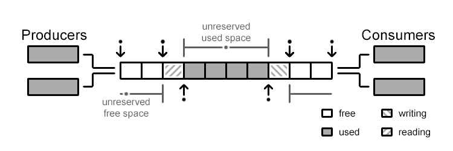

# Week 1

- Read 张超 reports.

## What is uring?

[uring][uring ref]

- SQ: Submission queue based on circular queue
- CQ: Completion queue based on circular queue
- SQE/CQE: the entry of SQ/CQ

In linux design, SQ only store the serial number of SQEs, CQ store the whole data.

Submission:

- Put SQE in SQEs, record cardinal, update SQ tail.
- Repeat for multiple task.

Completion:

- Kernel complete task, update CQ head.
- User receive task,  update CQ tail.

[uring ref]: https://www.skyzh.dev/blog/2021-06-14-deep-dive-io-uring/

## What is a lock free ring buffer?

[ring][ring ref]



Reserve commit to retain space before really modifying. 

[ring ref]: https://kmdreko.github.io/posts/20191003/a-simple-lock-free-ring-buffer/

## Design IPC

[IPC][IPC ref] (Refactored by AI to reduce redundant design.)

Combine the convenience of uring to establish asynchronous communication.

User:

- call asynchronous kernel function, e.g. `async_read(...)`.
- function will create a `Future` specific for uring called `UringFuture`.
- `spawn()` will push the future wrapped as `Task` into `Executor`.
- When `Executor` first poll the task, it add it to SQ.

Kernel:

- initiate SQ,CQ, `Executor`.
- read and implement `SQE`.
- write `CQE` packed task.

Executor:

- poll task
- submit the SQE of some tasks in batch by `io_uring_submit`.
- read CQE of its `TaskRef` to wake, thus proceed future.

Based on original logic, user calling any kernel asynchronous task will put on the SQE.

Kernel has `Executor` and `Reactor`


[IPC ref]: https://github.com/loichyan/openoscamp-2025s/discussions/8

## Tokio-Uring

[Tokio Uring][Tokio Uring ref]

Tokio uring initialize io-uring SQ,CQ and epoll based runtime. Using asynchronous task `epoll_wait` to notify and draining all completion tasks.

> When the kernel pushes a completion event onto the completion queue, "epoll_wait" unblocks and returns a readiness event. The Tokio current-thread runtime then polls the io-uring driver task, draining the completion queue and notifying completion futures.

Tokio uring use thread-per-core design in which completion future will not implement `Send`, thus the task awaiting these operations are also not `Send`.

Thus user need to take care of load balance, a suggestion as follows:

```rust
let listener = Arc::new(TcpListener::bind(...));

spawn_on_each_thread(async {
    loop {
        // Wait for this worker to have capacity. This
        // ensures there are a minimum number of workers
        // in the runtime that are flagged as with capacity
        // to avoid total starvation.
        current_worker::wait_for_capacity().await;
        
        let socket = listener.accept().await;
        
        spawn(async move { ... });
    }
})
```

Tokio uring use ownership to take over resource control to avoid cancellation problem.

```rust
/// The caller allocates a buffer
let buf = buf::IoBuf::with_capacity(4096);

// Read the first 1024 bytes of the file, when `std::ops::Try` is
// stable, the `?` can be applied directly on the `BufResult` type.
let BufResult(res, buf) = file.read_at(0, buf.slice(0..1024)).await;
```

> the operation futures may not own data referenced by the in-flight operation. The tokio-uring runtime will take ownership and store resources referenced by operations while they are in-flight.

Thus runtime will take over the resource by:

```rust
struct IoUringDriver {
    // Storage for state referenced by in-flight operations
    in_flight_operations: Slab<Operation>,
    
    // The io-uring submission and completion queues.
    queues: IoUringQueues,
}

struct Operation {
    // Resources referenced by the kernel, this must stay
    // available until the operation completes.
    state: State,
    lifecycle: Lifecycle,
}

enum Lifecycle {
    /// The operation has been submitted to uring and is currently in-flight
    Submitted,

    /// The submitter is waiting for the completion of the operation
    Waiting(Waker),

    /// The submitter no longer has interest in the operation result.
    Ignored,

    /// The operation has completed. The completion result is stored. 
    Completed(Completion),
}
```

- `Operation` struct keeps the data referenced by the operation submitted to kernel. 
- Runtime will allocate the `Operation` to store data which submitted operation needs as `Submitted` state.
- If runtime receive the completed results, it store the results and transitions to `Completed` state.
- If future drops before the operation complete, drop function will remove the request otherwise it set the state to `Ignored` and submit a cancellation request to Kernel.

[Tokio Uring ref]: https://github.com/tokio-rs/tokio-uring/blob/7761222aa7f4bd48c559ca82e9535d47aac96d53/DESIGN.md

## Monoio

> **Waited to be implemented**

## Evering

[Evering ref][Evering ref]

### Uring


[Evering ref]: https://github.com/loichyan/openoscamp-2025s/tree/main/evering