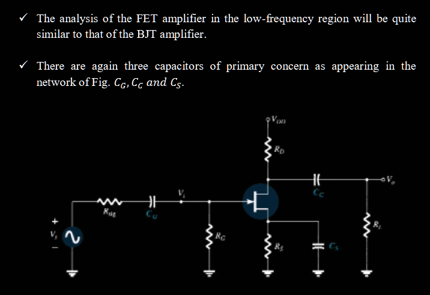
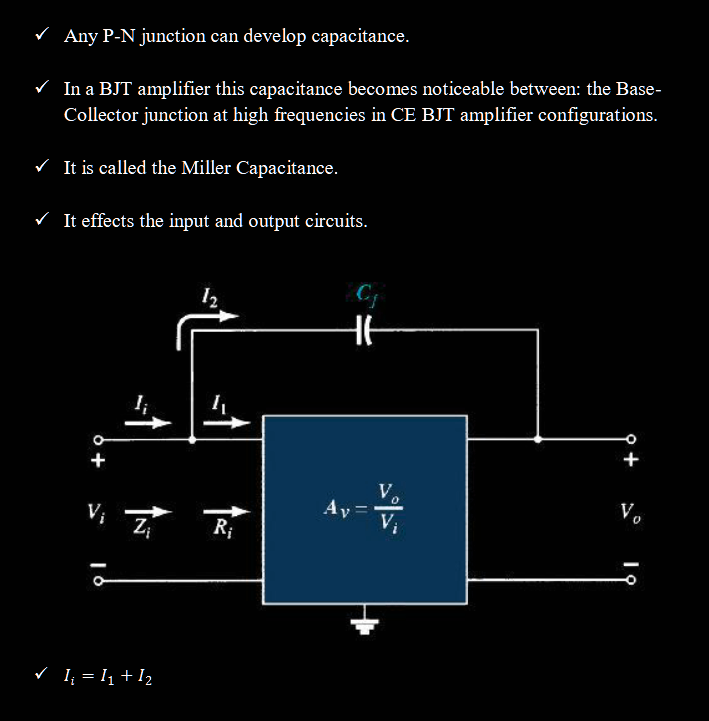
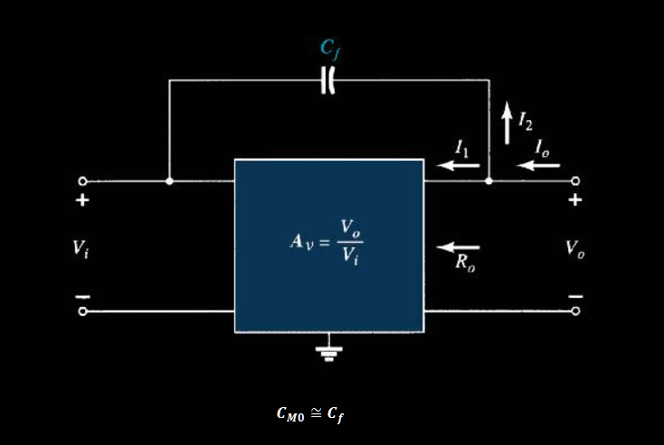
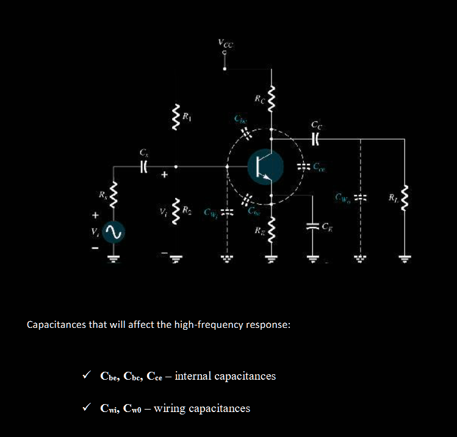
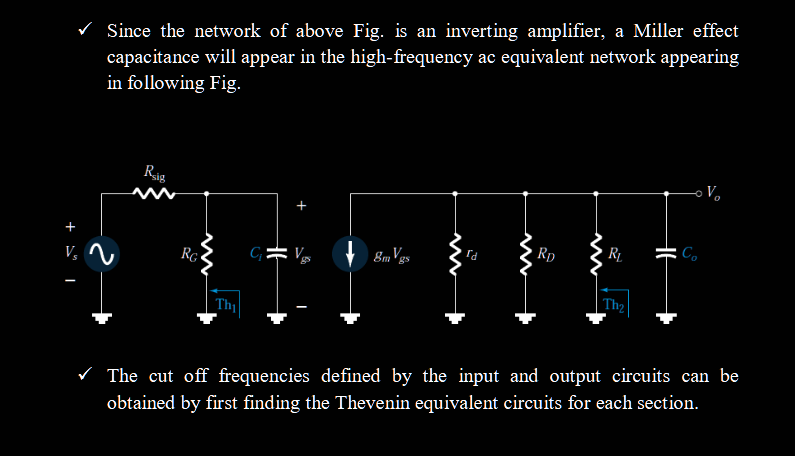

## Transistor

For a small signal $\widetilde{v_{be}}$ gives:
$$
v_{be} = V_{be} + \widetilde{v_{be}} \\
i_c = I_se^{v_{be}/V_T} = I_se^{(V_{be} + \widetilde{v_{be}})/V_T} = I_ce^{ \widetilde{v_{be}} /V_T}
$$

We suppose a linear approximation which is the presumption.

$$
i_c = I_c(1 + \widetilde{v_{be}}/V_T) \\
\widetilde{i_c} = I_c \widetilde{v_{be}}/V_T = g_m\widetilde{v_{be}}
$$

Based on this and static point, we get:
$$
\widetilde{i_b} = \frac{1}{\beta}\widetilde{i_c} \\
\widetilde{i_e} = \frac{\beta+1}{\beta}\widetilde{i_c} \approx \widetilde{i_c} \\
$$

We define $r_\pi = \widetilde{v_{be}}/i_b$ Then:
$$
r_\pi = \frac{\beta}{g_m} = \frac{V_T}{I_b} \\
r_e = \frac{\widetilde{v_{be}}}{i_e} = \frac{\beta+1}{\beta g_m} \approx \frac{1}{g_m} \\
r_\pi = (\beta+1)r_e \approx \beta r_e
$$

Which is the internal impedance of transistor. Usually we approximate in daily temperature and yields $r_e = \frac{26\text{mV}}{I_e}$

## MOSFET

$V_{TN}$ is the truncated voltage to set the channel.

The charge between $x$ to $x + dx$ is given by:

$$
V_{Gx} = V_{GS} + V_{Sx} = V_{GS} - V(x) \\
dQ(x) = C_{0x}W(V_{GS} - V(x) - V_{TN})dx \\
I(x) = C_{0x}W(V_{GS} - V(x) - V_{TN})v_{0x} \\
v_{0x} \sim \sigma E(x) = -\sigma \frac{dV(x)}{dx} \\
\int_0^L I(x) dx = \sigma C_{0x} W \int_0^{V_{DS}}(V_{GS}-V(x)-V_{TN})dV(x) \\
I_{D} = \sigma C_{0x} \frac{W}{L}(V_{GS}-V_{TN}-V_{DS}/2)V_{DS} \\
$$

For saturation state: $V_{DS} < V_{GS}-V_{TN}$

$$
r_\pi = \frac{V_{DS}}{I_{D}} \approx \sigma C_{0x} \frac{W}{L}(V_{GS}-V_{TN})V_{DS} = k(...)
$$

which is linear.

For pitch-off state: $V_{DS} > V_{GS}-V_{TN}$, It will stuck at equal to get a fully saturation.
$$
I_{D} = \frac{k}{2}(V_{GS}-V_{TN})^2 \\
= I_{DSS}(\frac{V_{GS}}{V_{TN}}-1)^2
$$

We could construct same relation between $V_{GS}$ and $I_D$
$$
\begin{align}
g_m &= \frac{dI_{D}}{dV_{GS}} \\
&= I_{DSS}2(\frac{V_{GS}}{V_{TN}}-1)(-\frac{1}{V_{TN}}) \\
&= \frac{2I_{DSS}}{V_{TN}}(\frac{V_{GS}}{V_{TN}}-1) \\
&= g_{mo}(1-\frac{V_{GS}}{V_{TN}}) \\
r_d &= \frac{dV_{GS}}{dI_D} \\
\end{align}
$$

Now we conclude the final model.

---

1 decibels = 1 bel
$$
\text{G} = ln(P_2/P_1) \text{bel} \\
\text{GdB} = 10 (...) \text{dB} \\
\text{GdB} = 20 ln(V_2/V_1) \text{dB}
$$

We may choose $P_1 = 1\text{mW}$ as reference.

We choose $A_{mid} = \frac{1}{\sqrt{2}}$ as mid point:
**mid = mid band**
**HPF = half power frequency**
$$
P_{HPF} = |V_o|^2/R =\frac{1}{2} |A_{mid}V_i|^2/R = \frac{1}{2}P_{mid}
$$

We choose mid band $A_{mid}$ as reference point, gives:
$$
A_v/A_{mid}\text{dB} = 20 ln(A_v/A_{mid})
$$

Basic analysis on RC:

$$
V_o = \frac{RV_i}{R-jX_C} \\
|V_o| = \frac{RV_i}{\sqrt{R^2 + X_C^2}} \\
|V_o||_{X_C = R} = \frac{1}{\sqrt{2}}V_i \\ 
$$

Concrete:
$$
\begin{align}
A_v &= \frac{1}{1-j\frac{1}{\omega CR}} \\
&= \frac{1}{1-j\frac{\omega_1}{\omega}} \quad \omega_1 = \frac{1}{CR} \\
&= \frac{1}{\sqrt{1+(\frac{\omega_1}{\omega})^2}}\angle tan^{-1}(\omega_1/\omega) \\
A_v\text{dB} &= 20ln(...) = -10ln(1+(\frac{\omega_1}{\omega})^2) \\
\end{align}
$$

We see that if $\omega_1 = \omega$, we get $A_v\text{dB} = -10 ln2 = 20 ln (1/\sqrt{2})$.

In lower freq, capacitors impedance mainly from outer capacitor like $C_G$ etc... it will be considered as the high pass filter **HPF**, which allows high freq pass.

$$
f_{L_G} = \frac{1}{C_G (R_{sig} + R_i)} \quad R_i = R_G  \\
f_{L_C} = \frac{1}{C_C (R_{L} + R_o)} \quad R_o = R_D || r_d \\
f_{L_S} = \frac{1}{R_{eq} C_S} \quad R_{eq} = \frac{R_S}{1+R_S(1+g_m r_d)/(r_d + R_D||R_L)}
$$

$C_G$:
At mid or high frequencies, the reactance of the capacitor will be sufficiently small to permit a short-circuit approximations for the element.

$C_E$:
At low frequencies, with the bypass capacitor CE in its “open circuit” equivalent state, all of RE appears in the gain equation above, resulting in  minimum gain.

Although each will affect the gain in a similar frequency range, the highest low frequency cut off determined by each of the three capacitors will have the greatest impact.

$$
I_i = V_i/Z_i \\
I_1 = V_i/R_i \\
I_2 X_{cf} = (V_i - V_o) \\
I_2 = V_i(1-A_v)/X_{cf} \\
V_i/Z_i = V_i/R_i + V_i(1-A_v)/X_{cf} \\
1/Z_i = 1/R_i + \frac{1}{\frac{X_{cf}}{1-A_v}} \\
1/Z_i = ... + 1/X_{CM} \\
$$

Where we see that:
$$
X_{cf}/(1-A_v) = 1/(\omega C_f(1-A_v))
$$
Is the input miller capacitance.

Suppose for output, $I_1 = V_o/R_o$ is small compared to $I_2$.
$$
I_o = I_1 + I_2 \approx (V_o-V_i)/X_{cf}\\
I_o = (V_o(1-1/A_v))/X_{cf} \\
V_o/I_o = \frac{X_{cf}}{1-1/A_v} \\
= 1/(\omega C_f (1-1/A_v)) = 1/(\omega C_{Mo})
$$

Is the output miller capacitance, if $A_v >> 1$, we get $C_{Mo} = C_{f}$.

---

In high freq, the main factor is the internal capacitance which drops quickly causing the internal voltage dividing.

We reverse previous analysis that:

$$
A_v\text{dB} = 20ln(...) = -10ln(1+(\frac{\omega}{\omega_2})^2)
$$

Where we choose capacitance as the analysis object. In high freq, we see that it decide the voltage sharing of MOSFET.

$$
f_{Hi} = \frac{1}{C_i R_{Th_1}} \\
R_{Th_1} = R_{sig} || R_G \\
C_i = C_{W_i} + C_{gs} + (1-A_v) C_{gd} \\
f_{Ho} = ... \\
R_{Th_2} = R_D || R_L || r_d \\
C_o = C_{Wo} + C_{ds} + (1-\frac{1}{A_v})C_{gd}
$$

---

### Square Wave Test

$$
v_sq(t) = C\sum_n \frac{1}{2n+1}sin(2n+1)\omega t
$$

- Lower cut off: Droop
  The low freq component of wave can't be amplified cause the wave concave in the middle, and arching toward in edge for a period.
- High cut off: rounding
  The high freq component of wave can't be amplified cause the wave arching toward in middle, concave in the edge which is rounding for a period.

## Feedback and Oscillators

Consider a parameter $X$ and amplification index $A = X_{out}/X_{in}$.

Amplifier: $A = X_{out}/X_{in}$
Feedback: $\beta = X_{f}/X_{out}$
Source: $X_s = X_f + X_{in}$

$$
A_f = \frac{X_{out}}{X_{s}} = \frac{A X_{in}}{A\beta X_{in} + X_{in}} \\
= \frac{A}{A\beta + 1}
$$

If $A \gg 1$, give us $A_f = \frac{1}{\beta}$

Suppose parameter $Y$, we want to find the connection between $X_s$:

Basic relation: $Z_iP = X_i$
Want to find: $Z_{if}P = X_s$

$$
X_s = (A\beta+1)X_i \\
Z_{if} = (A\beta+1)Z_i
$$

For output parameter, given $X_s = 0$, and a test parameter $X_t = PZ_t + X_o$

Basic relation: $X_s = 0 \to X_i + X_f = 0$
Second, now $X_f \neq X_o$, rather $X_f = X_t$
So: $X_o = -AX_f = -A\beta X_t$
$$
X_t = PZ_t - A\beta X_t \\
X_t = P\frac{Z_t}{1+A\beta} \\ 
$$

This means for any $IV,VV,VI,II$, the amplifier relation is always valid that:
$$
A_f = \frac{A}{A\beta+1}
$$

However, for $II$:

$$
Z_{if}P = X_s \to Z_{if}V = I_s \\
Z_{if} = (A\beta+1)Z_i \\
R_{if} = (A\beta+1)^{-1}R_i \\
$$

Samely, we get $R_{of} = (A\beta+1)R_o$

For $IV$:
$$
Z_{if} P = I_s \\
I_s = (A\beta+1)I_i \\
R_{if} = (A\beta+1)^{-1}R_{i} \\
$$

But in output end $X_t = V_t$.
$$
X_t = V_t = P(R_t/(1+A\beta)) = PR_{ft}
$$

The bandwidth will also be affected:

$$
|\frac{dA_f}{A_f}| = \frac{1}{\beta A} |\frac{dA}{A}|
$$

Which is a reduction, but also Slow down the rate of decline, extending the bandwidth.

### Stability

To systematically analyze stability across all frequencies, the Nyquist method is a widely used technique. It provides a graphical way to determine stability based on the frequency response of the loop gain $\beta A$.

Nyquist graph is a complex loop measure the $|\beta A|$ and $\angle \beta A$ as phase shift.

An amplifier is stable iff doesn't circle point $(-1,0)$.

Reason: If the Nyquist plot encircles this point, it means there is at least one frequency where the loop gain magnitude is greater than 1, and with a phase shift $\pi = 180 \degree$. That's means, feedback signal $X_f$ is exactly the in phase with input signal $X_s$, cause the magnitude larger than input signal it produced. Lead to a diverge behavoir.

Then we can quantify how stable it's:

- Gain Margin (GM): GM is the amount by which the loop gain magnitude can be increased before instability occurs. It is formally defined as the negative of the loop gain magnitude (in decibels) at the frequency where the phase shift is $180 \degree$.

If GM > 0 dB, the amplifier is stable (at 180° phase shift, ∣βA∣<1).
If GM < 0 dB, the amplifier is unstable (at 180° phase shift, ∣βA∣>1).
A larger positive GM indicates greater stability.

- Phase Margin (PM): PM is the amount by which the phase shift can be increased (or the frequency changed) before instability occurs. It is defined as 180° minus the magnitude of the phase angle at the frequency where the loop gain magnitude is unity (|βA| = 1 or 0 dB).

If PM > 0°, the amplifier is stable (at the frequency where ∣βA∣=1, the phase shift is less than 180°).
If PM < 0°, the amplifier is unstable (at the frequency where ∣βA∣=1, the phase shift is greater than 180°).
A larger positive PM indicates greater stability.